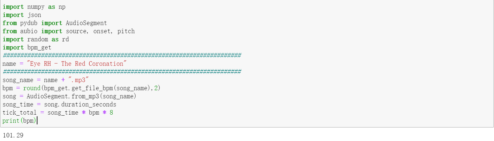

# AITUS Heuristic
 an automatic note maker for CYTUS.

**根据指定乐曲自动生成CYTUS游戏谱面。这里是Heuristic版本，1.0版本参见分支。**

效果展示：

https://www.bilibili.com/video/BV1v34y1r7tQ

这只是作者的一个初次尝试，欢迎感兴趣的小伙伴进行优化或提出新方法！

# 共享链接

**作者在这里设置了一个共享链接，用于分享AITUS创作的游戏谱面。**

链接：https://pan.baidu.com/s/1dGaLOuBKdeXBRZt1NuP9WA?pwd=aicy 
提取码：aicy

**您可以私信给作者您想要创作谱面的乐曲，作者生成谱面后会上传到这个链接里。**

# 前置准备

AITUS Heuristic采用Python语言编写，需要额外依赖的包有：

- aubio

- pydub

- NumPy

  除此之外，您还需要安装cytus制谱软件【Cylheim】。

# 使用说明

【step 1】

将乐曲转为mp3格式，并放在与代码相同的目录下。

【step 2】

运行Heuristic.ipynb的第一个block，其中name修改为音乐文件名（不含后缀），得到乐曲的bpm。

【step 3】

使用【Cylheim】创建空谱面，创建空谱面时需要导输入乐曲、bpm等信息。创建好的谱面是一个json文件。该json文件的命名应与乐曲文件的命名相同。

【step 4】

将创建好的谱面json文件放在与代码相同的目录下，然后继续运行Heuristic.ipynb的剩余block，约30s后运行结束，得到生成好的json谱面文件（命名与乐曲命名相同）。

【step 5】

用【Cylheim】打开json文件，即可进行谱面的可视化与cytoid导出。

【Cylheim】的使用教程可参考：https://www.bilibili.com/video/BV1Ly4y1m7Np

# 原理简介

与分支aitus-1.0不同，Heuristic版本通过aubio库对节奏点进行识别，并在此基础上通过一系列人为设定的规则生成游戏谱面。

