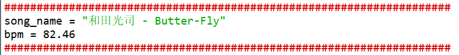

# AITUS
 an automatic note maker for CYTUS.

**利用AI根据指定乐曲生成CYTUS游戏谱面。**

效果展示：https://www.bilibili.com/video/BV1Lf4y1F7aq

这只是作者的一个初次尝试，欢迎感兴趣的小伙伴进行优化或提出新方法！

# 共享链接

下面的3、4部分介绍了AITUS的使用方法，比较繁琐，且需要安装许多软件。鉴于此，**作者在这里设置了一个共享链接，用于分享AITUS创作的游戏谱面。**

链接：https://pan.baidu.com/s/1dGaLOuBKdeXBRZt1NuP9WA?pwd=aicy 
提取码：aicy

**您可以私信给作者您想要创作谱面的乐曲，作者生成谱面后会上传到这个链接里。**

# 前置准备

使用AITUS一共需要以下软件作为辅助：

- 格式工厂（或其他音频文件格式转化软件）
- MixMeister BPM Analyzer，用于获取乐曲bpm
- Cylheim，CYTUS游戏谱面制作器
- Python3
- PyTorch2

# 使用说明

【step 1】

将乐曲转为wav格式。

【step 2】

使用软件【MixMeister BPM Analyzer】测量乐曲的bpm。

【step 3】

使用【Cylheim】创建空谱面，创建空谱面时需要导入乐曲、bpm等信息。创建好的谱面是一个json文件。该json文件的命名应与乐曲文件的命名相同。

【step 4】

将创建好的谱面json文件、乐曲wav文件、model下的四个pt文件、code下的【NoteMake.py】放在同一目录下，并修改【NoteMake.py】中如下图所示的乐曲信息：

然后运行NoteMake.py，约5-10分钟后运行结束，得到生成的json谱面文件（命名与乐曲命名相同）。

【step 5】

用生成的json去替换原【Cylheim】项目下的json文件，然后打开【Cylheim】项目即可看见和演示生成的谱面。

# 原理简介

**训练数据来自CYTUS**

训练所用的乐曲和谱面信息来自CYTUS。

**从音乐到图像**

为了利用CNN，将读入的一段乐曲信号按顺序转化为若干80×80的图片，并根据谱面文件的信息给每张图打tag。

**分工训练**

为了生成游戏谱面，一共训练了四个模型：

ExistModel：判断一张图是否有key。

PosModel：如果一张图中有key，判断这个key的横坐标。

TypeModel：如果一张图中有key，判断这个key的类型（由于CYTUS1代只有click、hold、chain三种类型的key，因此AITUS目前也只考虑了这三种类型）。

TimeModel：如果一张图中对应的key是hold，判断这个hold的持续的时间。

**一些调整**

生成的谱面谱面并不那么如意，因此在【NoteMake.py】中还对模型的输出结果做了调整（详情请见代码）。
